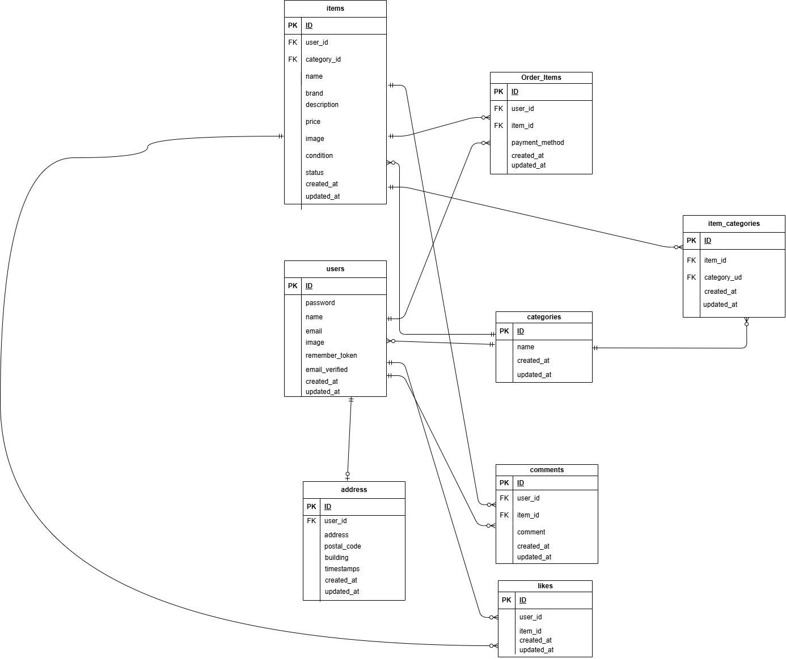

# ECサイト

## 環境構築

### Dockerビルド

1. `git clone git@github.com:Kotaro-905/ec-site.git`
2. `docker-compose up -d --build`

> 💡 **注意**
> MySQLは、OSによって起動しない場合があるため、必要に応じて
> `docker-compose.yml` ファイルを編集してください。

---

### Laravel環境構築

1. `docker-compose exec php bash`
2. `composer install`
3. `.env.example` ファイルから `.env` を作成し、環境変数を変更
4. `php artisan key:generate`
5. `php artisan migrate`
6. `php artisan db:seed`
7. `php artisan storage:link`

---

### 環境変数

`STRIPE_KEY` と `STRIPE_SECRET` は未設定です。
Stripe管理画面よりキーを取得して設定してください。

---

## 使用技術

* PHP **8.1.33**
* Laravel **8.83.29**
* MySQL **8.0.26**
* Docker（開発環境）
* Laravel Fortify（認証機能）
* HTML / CSS（クラスベースのスタイリング）

---

## テスト実行手順

### 1. テスト用データベースを作成

```bash
docker exec -it ec-site-mysql-1 bash
mysql -u root -p
# パスワード: root
CREATE DATABASE laravel_test;
exit
exit
```

### 2. テスト環境でマイグレーションを実行

```bash
docker-compose exec php bash
php artisan migrate:fresh --env=testing
```

> * 上記コマンドにより、`laravel_test` データベース上にテーブルが再作成されます。
> * `--env=testing` オプションにより、`.env.testing` の設定が使用されます。
> * 既存テーブルをすべて削除して再構築する場合に `migrate:fresh` を使用します。

### 3. php artisan testで全テスト実行。

---

## 補足

* 鈴木北斗コーチから、機能要件 FN012 の通り メール認証画面から商品一覧画面に遷移する仕様でとお聞きしています （Figmaとは導線が異なりますが、機能要件を優先）。
* 鈴木北斗コーチから、未ログイン状態ではマイリストを非表示とお聞きしています。
* 会員登録時のパスワードは **8文字以上** の入力をお願いします。

---

## URL

* 開発環境: [http://localhost/](http://localhost/)
* phpMyAdmin: [http://localhost:8080](http://localhost:8080/index.php?route=/database/structure&db=information_schema)

## ER図
